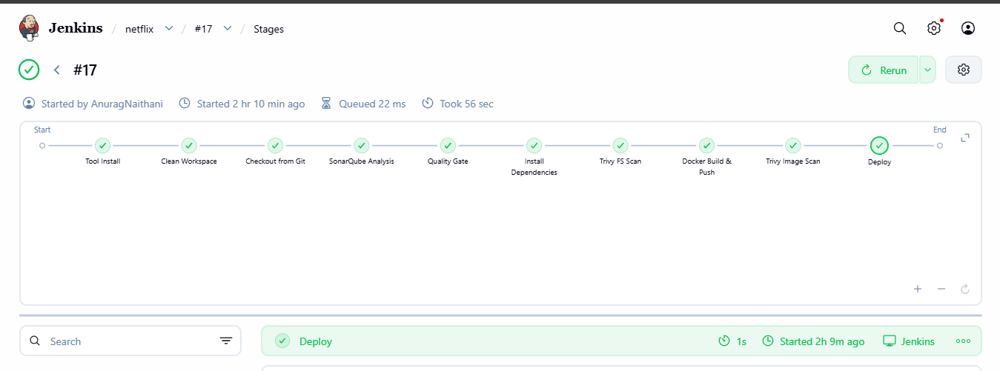
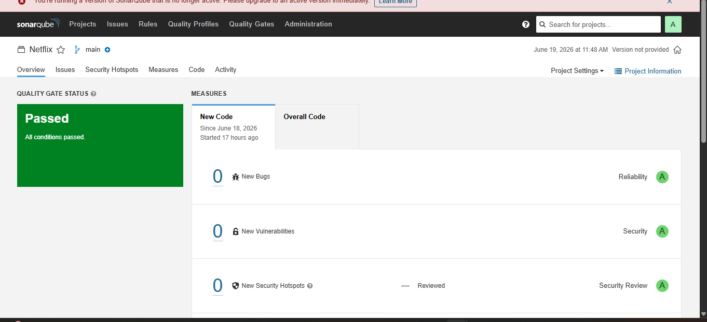
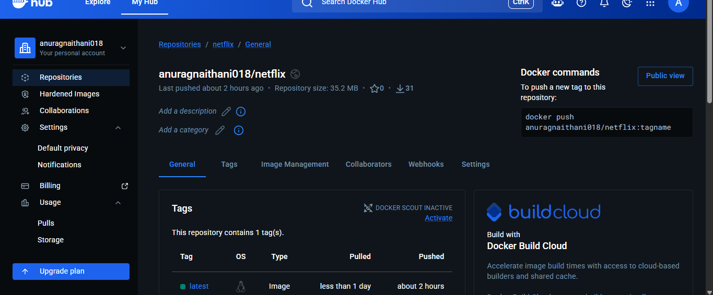
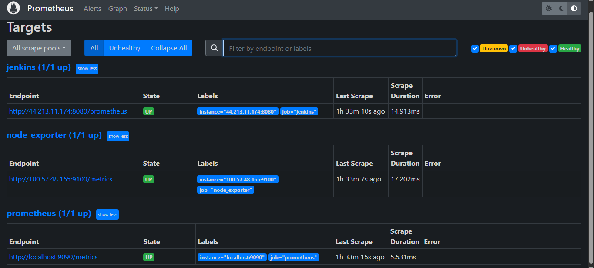
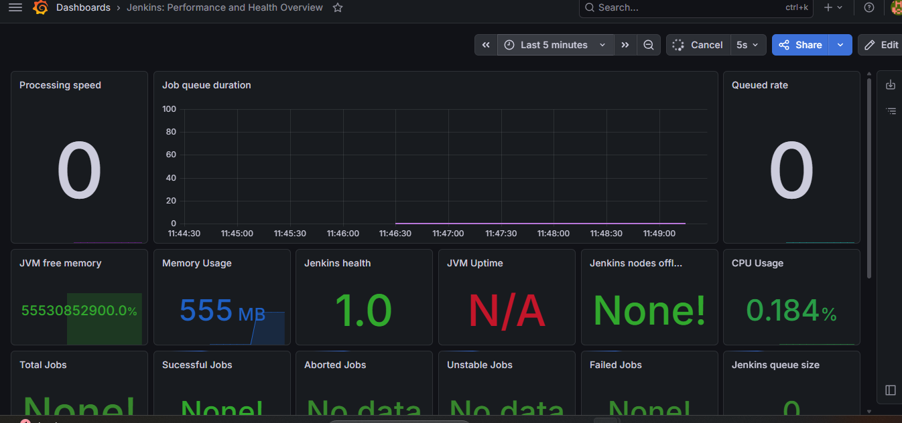
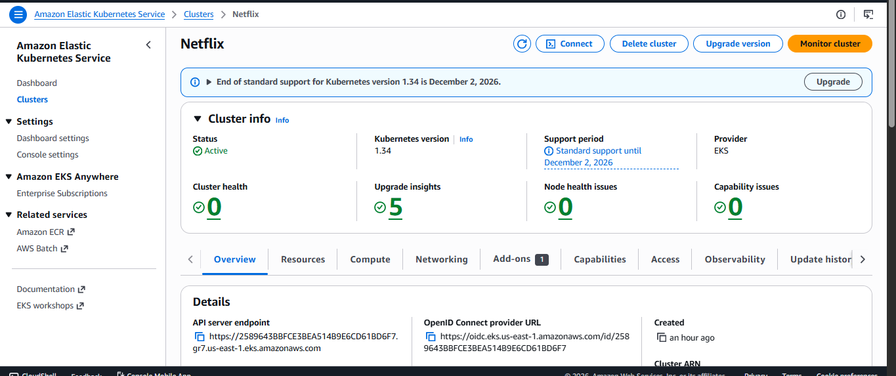
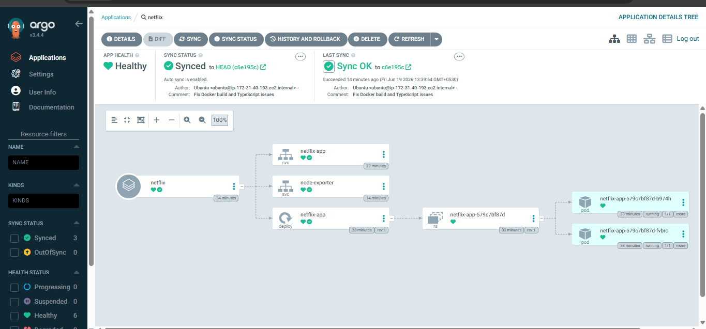
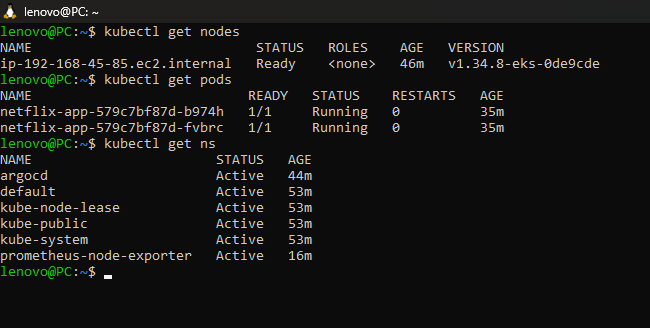
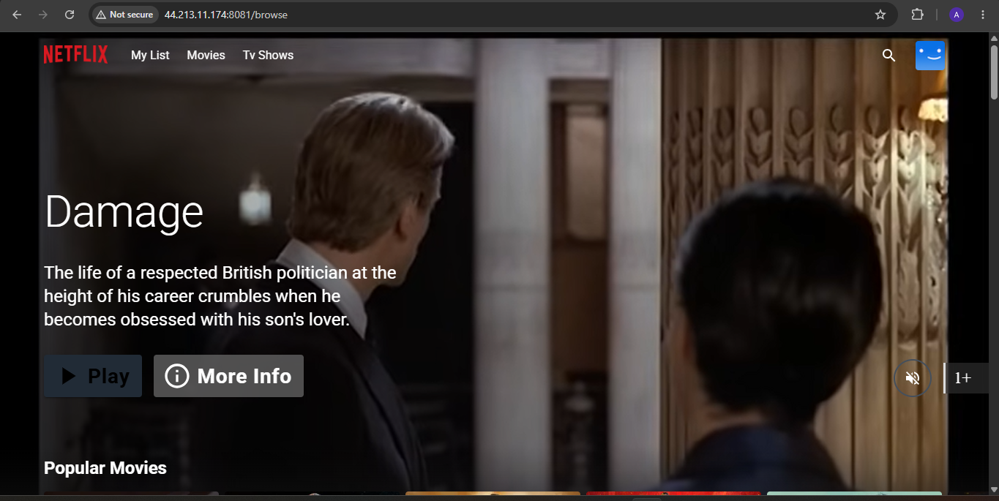

# 🎬 Netflix DevSecOps Project

A complete end-to-end **DevSecOps pipeline** built for a Netflix-style web application using industry-standard tools and AWS cloud services. This project demonstrates CI/CD automation, security scanning, GitOps deployment, Kubernetes orchestration, and monitoring.

---

## 🚀 Project Overview

This project implements a complete DevSecOps workflow from source code to production deployment. The pipeline integrates security and monitoring at every stage to simulate a production-ready environment.

### Key Features

- ✅ CI/CD Automation using Jenkins
- ✅ Static Code Analysis with SonarQube
- ✅ Vulnerability Scanning using OWASP Dependency Check
- ✅ Container Security with Trivy
- ✅ Docker Image Build & Push
- ✅ Kubernetes Deployment on Amazon EKS
- ✅ GitOps Deployment with ArgoCD
- ✅ Monitoring with Prometheus & Grafana
- ✅ Production-style DevSecOps Architecture

---

# 🏗️ Project Architecture

```text
GitHub Repository
        │
        ▼
Jenkins CI/CD Pipeline
        │
        ▼
SonarQube Analysis
        │
        ▼
OWASP Dependency Check
        │
        ▼
Trivy Security Scan
        │
        ▼
Docker Image Build
        │
        ▼
Docker Hub Registry
        │
        ▼
ArgoCD (GitOps)
        │
        ▼
Amazon EKS Cluster
        │
        ▼
Netflix Application
        │
        ▼
Prometheus Monitoring
        │
        ▼
Grafana Dashboard
```

---

# 🛠 Technologies Used

| Category | Tools |
|------------|-------|
| Frontend | React, Vite |
| CI/CD | Jenkins |
| Code Quality | SonarQube |
| Dependency Scanning | OWASP Dependency Check |
| Container Security | Trivy |
| Containerization | Docker |
| Container Registry | Docker Hub |
| Orchestration | Kubernetes |
| GitOps | ArgoCD |
| Monitoring | Prometheus, Grafana |
| Cloud | AWS EC2, AWS EKS |

---

# ⚙️ CI/CD Workflow

### Infrastructure Setup

- Launch Ubuntu EC2 Instances
- Configure Docker and dependencies
- Clone application repository
- Build and run containers

### Security Integration

- SonarQube Static Code Analysis
- OWASP Dependency Check
- Trivy Filesystem Scan
- Trivy Image Scan

### CI/CD Automation

- Jenkins Pipeline
- Docker Build and Push
- Automated Deployment

### Monitoring & Observability

- Prometheus
- Node Exporter
- Grafana Dashboards

### Kubernetes Deployment

- Amazon EKS Cluster
- Kubernetes Manifests
- ArgoCD GitOps Deployment

---

# 📸 Project Screenshots

## 1. Jenkins Pipeline Success



---

## 2. SonarQube Dashboard



---

## 3. Docker Hub Repository



---

## 4. Prometheus Targets



---

## 5. Grafana Dashboard



---

## 6. Amazon EKS Cluster



---

## 7. ArgoCD Healthy & Synced



---

## 8. Kubernetes Worker Node



---

## 9. Netflix Application Running



---

# 📚 Learning Outcomes

Through this project, I gained practical experience in:

- CI/CD Pipeline Design
- DevSecOps Best Practices
- Static Code Analysis
- Container Security
- Docker & Kubernetes
- GitOps with ArgoCD
- Infrastructure Monitoring
- Cloud Deployment on AWS
- Production-grade Deployment Strategy

---

# 👨‍💻 Author

## Anurag Naithani

### GitHub

https://github.com/anuragnaithani

### LinkedIn

https://www.linkedin.com/in/anurag-naithani/

---

# ⭐ If you found this project useful, consider giving it a star.
